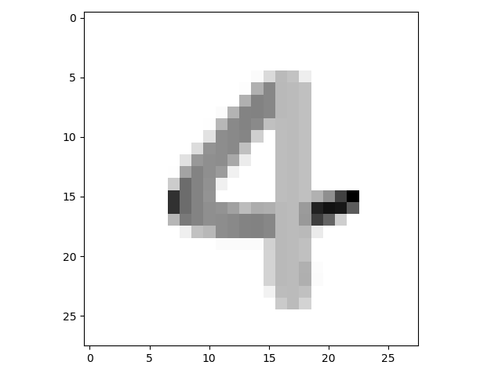
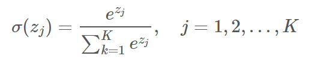
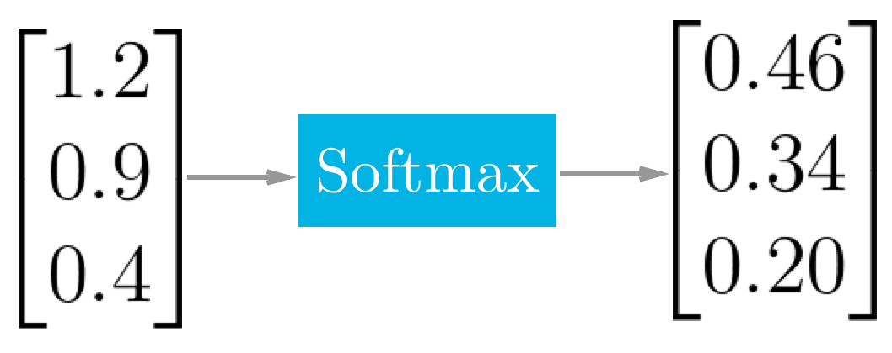
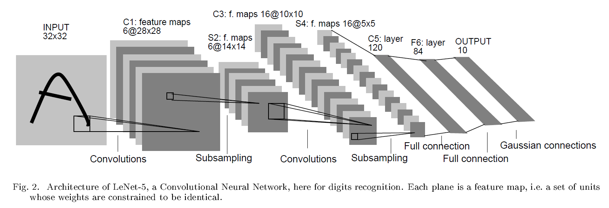

> **MINST** (Modified National Institute of Standards and Technology) 是计算机视觉方向最基础的数据集之一，自从 1999 年发布以来，这个手写图像数据集就成为了基准分类算法的基础。

TensorFlow 1.x 版本由于其较为复杂的机制（如 Session 等），与 Pytorch 相比编程的难度较高。于是 2019 年秋 TensorFlow 正式发布了 2.0 版本，此次更新并不向下兼容，更像是一个全新的框架 —— 在 2.0 版本中，Keras 被整合成为了 TensorFlow 的一个高级 API，使用 Keras 仅数十行便可以完成一个简单的神经网络搭建。

本文将基于 TensorFlow 2 的 Keras 框架进行 MINST 手写数字识别的相关讨论与探究。

# 问题描述

MINST 提供了从 0 到 9 共 10 个**灰度手绘数字**的图像，每个数字约有 7,000 种不同风格的手写体，所以在 MINST 中共有 70k 种样本可供训练模型。我们取 60k 用于训练，10k 用于测试。

每个图像都由一个 28 × 28 ​的矩阵组成，矩阵上的每个点的取值范围为 [0, 255]​，用来表示不同的灰度，如图所示：



机器需要完成一个任务：通过对数万张图片的学习，获得识别图片的能力。

那么如何训练一个深度学习模型来解决这个问题呢？

****

**详细讨论请见[基于卷积神经网络的MINST手写数字识别](https://bipy.me/post/minst-digit/)**


# 线性回归模型

通过构建不同的神经网络层，便可以得到想要的模型。

一个简单的线性回归模型网络层设计如下：

- 输入层 Flatten

    将输入 28 × 28 矩阵降维转化为 1 × 784 的形式

- 全连接层 Dense

    使用激活函数 ReLU 进行全连接降维映射

- 损失函数 Dropout

    一定概率使神经元置零，防止过拟合

- 输出层 Dense

    使用 softmax 激活函数将输出归一化





****

梯度下降优化算法选择了当前使用最广泛的 Adam。

它结合了 AdaGrad 和 Momentum 的优点。Momentum 可以看作是一个顺着斜坡滑下的球，而 Adam 的行为就像是一个带有摩擦的沉重的球——因此，它更喜欢在误差表面上保持平坦的最小值，在梯度优化算法中表现出十足的优势。


## Result

```
loss: 0.0142 - accuracy: 0.9954 - val_loss: 0.0767 - val_accuracy: 0.9806
```

对 10000 个样本进行测试，结果获得了 98.06% 的准确率，已经足够用于手写数字识别了。但能否获得更高的准确率呢？

要解决这个问题，需要在模型中引入卷积神经网络。


# 卷积神经网络模型

> **卷积神经网络**（Convolutional Neural Networks, CNN）是一类包含卷积计算且具有深度结构的前馈神经网络（Feedforward Neural Networks），是深度学习（deep learning）的代表算法之一 。卷积神经网络具有表征学习（representation learning）能力，能够按其阶层结构对输入信息进行平移不变分类（shift-invariant classification），因此也被称为 “平移不变人工神经网络（Shift-Invariant Artificial Neural Networks, SIANN）” 。



上图为经典的神经网络模型 LeNet-5 的结构示意图，网络输入是一个 32 × 32​ 的手写数字图像，输出是其识别结果， CNN 复合多个"卷积层"和"采样层"对输入信号进行加工，然后在连接层实现与输出目标之间的映射。

## Result

```
loss: 5.0962e-04 - accuracy: 0.9999 - val_loss: 0.0355 - val_accuracy: 0.9923
```

在引入卷积神经网络后，MINST 手写数字识别的准确率可以达到 99.23%，有了显著的提升。